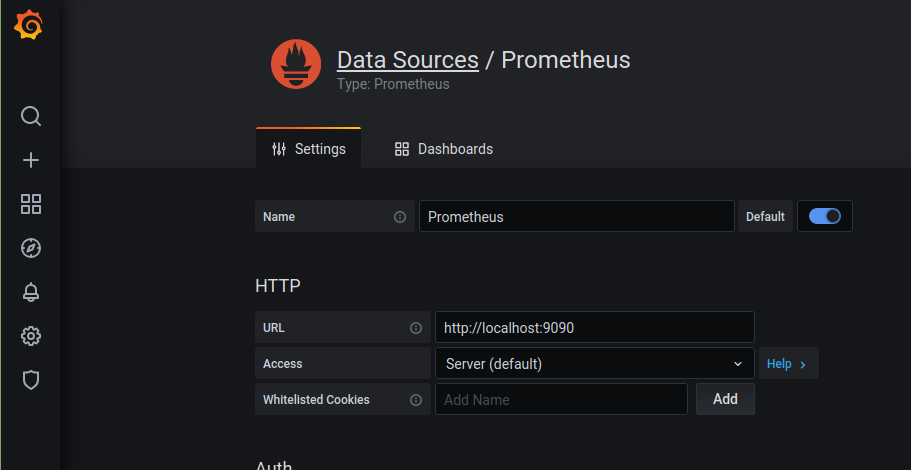
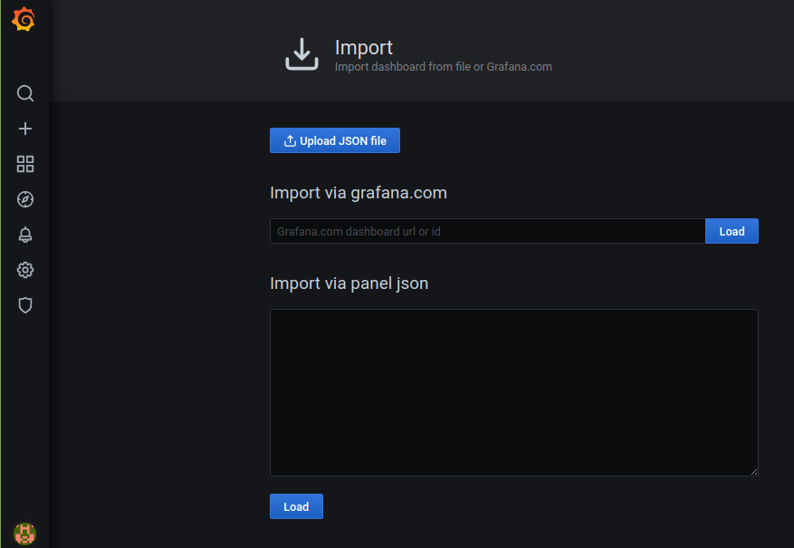
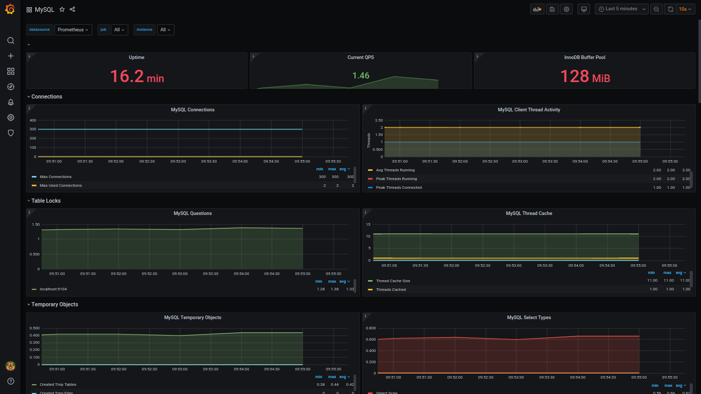

# Prometheus MySQL Server Exporter

## Run exporter

Execute command:

```shell
./cmd-run
```

## Register mysql user for exporter

Run inside docker mysql:

```shell
docker exec -it mysql-exporter bash
```

Login mysql as root using with identifier <code>password</code>

```shell
mysql -u root -p
```

Execute sql below

```shell
CREATE USER 'exporter'@'%' IDENTIFIED BY 'password' WITH MAX_USER_CONNECTIONS 3;
GRANT PROCESS, REPLICATION CLIENT, SELECT ON *.* TO 'exporter'@'%';
```

## Application

### mysqld exporter

Browse exporter web page: [metrics](http://localhost:9104/metrics)

### prometheus

Browse grafana: [prometheus](http://localhost:9090/targets)

### grafana

Browse grafana: [grafana](http://localhost:3000)

#### First login screen

* password: admin


#### Configure prometheus datasource

prometheus datasource:



#### Import mysql dashboard json from file

json file: <code>grafana/MySQL-1609789380031.json</code>



#### Sample grafana dashboard



## Stop exporter

Execute command:

```shell
./cmd-stop
```

## Clean up exporter

```shell
./cmd-clean
```